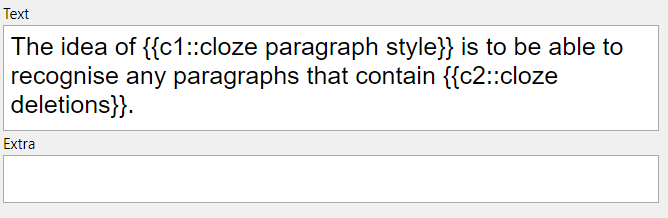
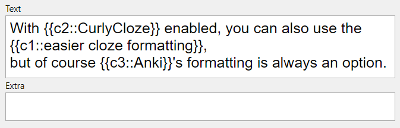

# Usage

**[[Regex]] line:** `((?:.+\n)*(?:.*{.*)(?:\n(?:^.{1,3}$|^.{4}(?<!<!--).*))*)`

1. Create a file called `test.md`
2. Paste the following contents into the file:

The idea of {cloze paragraph style} is to be able to recognise any paragraphs that contain {cloze deletions}.

The script should ignore paragraphs that have math formatting like $\frac{3}{4}$ but no actual cloze deletions.

With {2:CurlyCloze} enabled, you can also use the {c1|easier cloze formatting},
but of course {{c3::Anki}}'s formatting is always an option.

3. In the plugin settings, paste the Regex line into the 'Custom Regexps' field associated with 'Cloze'
4. Ensure that the 'Regex' and 'CurlyCloze' options are checked
5. Click the Anki icon on the ribbon to run the plugin

## All users
9. You should see these cards in Anki:  
  

### Highlight-cloze style (Obsidian Plugin only)

**Regex line**: `((?:.+\n)*(?:.*==.*)(?:\n(?:^.{1,3}$|^.{4}(?<!<!--).*))*)`

You can also use markdown highlights instead of curly braces in order to indicate cloze deletions - just use the above style, and also enable 'CurlyCloze - Highlights to Clozes'!
