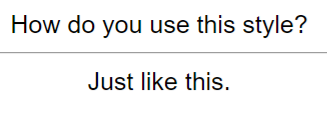
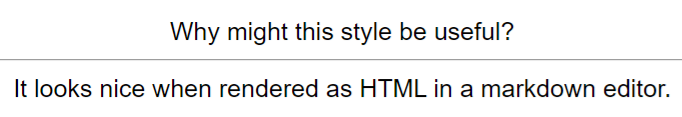

# Usage

**[[Regex]] line:** `\|([^\n|]+)\|\n\|(?:[^\n|]+)\|\n\|([^\n|]+)\|\n?`

1. Create a file called `test.md`.
2. Paste the following contents into the file:

<pre>
| How do you use this style? |
| ---- |
| Just like this |

Of course, the script will ignore anything outside a table.

| Furthermore, the script | should also |
| ----- | ----- |
| Ignore any tables | with more than one column |

| Why might this style be useful? |
| --------- |
| It looks nice when rendered as HTML in a markdown editor. |
</pre>
## Obsidian Plugin users
3. In the plugin settings, paste the Regex line into the 'Custom Regexps' field associated with 'Basic'
4. Ensure that the 'Regex' option is checked
5. Click the Anki icon on the ribbon to run the plugin

## All users
8. You should see these cards in Anki:  
  

