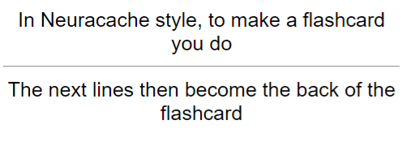
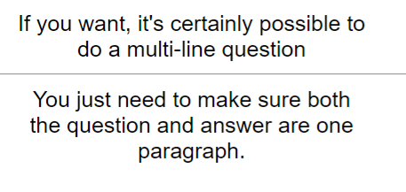
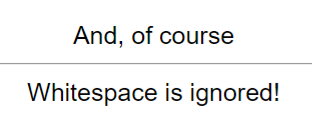

# Usage

**[[Regex]] line:** `((?:[^\n][\n]?)+) #flashcard ?\n*((?:\n(?:^.{1,3}$|^.{4}(?<!<!--).*))+)`

1. Create a file called `test.md`
2. Paste the following contents into the file:

<pre>
In Neuracache style, to make a flashcard you do #flashcard
The next lines then become the back of the flashcard

If you want, it's certainly possible to
do a multi-line question #flashcard
You just need to make sure both
the question and answer are one paragraph.

And, of course #flashcard

Whitespace is ignored!

</pre>
## Obsidian Plugin users
3. In the plugin settings, paste the Regex line into the 'Custom Regexps' field associated with 'Basic'
4. Ensure that the 'Regex' option is checked
5. Click the Anki icon on the ribbon to run the plugin

## All users
8. You should see these cards in Anki:  
  
  
  
