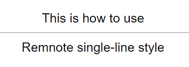
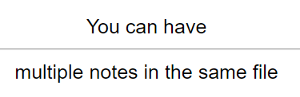

# Usage
**[[Regex]] line:** `^(.*[^\n:]{1}):{2}([^\n:]{1}.*)`

1. Create a file called `test.md`
2. Paste the following contents into the file:

<pre>
This is how to use::Remnote single-line style
The script won't see things outside of it.
You can have::multiple notes in the same file
</pre>
## Obsidian Plugin users
3. In the plugin settings, paste the Regex line into the 'Custom Regexps' field associated with 'Basic'
4. Ensure that the 'Regex' option is checked
5. Click the Anki icon on the ribbon to run the plugin

## All users
8. You should see these cards in Anki:  
  

