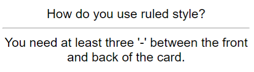
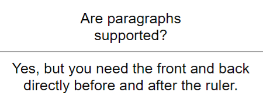

# Usage
**[[Regex]] line:** `((?:[^\n][\n]?)+\n)-{3,}((?:\n(?:^.{1,3}$|^.{4}(?<!<!--).*))*)`

1. Create a file called `test.md`
2. Paste the following contents into the file:

<pre>
How do you use ruled style?
---
You need at least three '-' between the front and back of the card.

Are paragraphs
supported?
---------
Yes, but you need the front and back
directly before and after the ruler.
</pre>
## Obsidian Plugin users
3. In the plugin settings, paste the Regex line into the 'Custom Regexps' field associated with 'Basic'
4. Ensure that the 'Regex' option is checked
5. Click the Anki icon on the ribbon to run the plugin

## All users
8. You should see these cards in Anki:  
  

